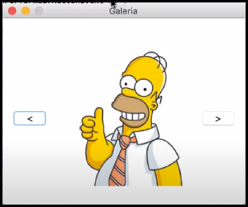

<h1 align="center">Image Viewer 🖼️</h1>
<h2 align="center">
  
</h2>

## About

Practicing the proxy pattern using the MVP architectural style. This project aims to create a simple image viewer application that employs the proxy pattern for efficient image loading and tracking.

## Project Structure 📂

The project follows the standard Maven directory structure. Here's an overview of the main components:

- **`util`**: Contains the `AccessCounter` class, responsible for tracking the number of times an image is accessed.
- **`ui`**: Holds the user interface-related classes, including the `ImageDisplay` interface and its Swing implementation.
- **`persistence`**: Manages image loading and includes the `FileImageLoader` class.
- **`model`**: Defines the core data model, including the `Image` interface, `RealImage`, and `ProxyImage` implementations.
- **`controller`**: Contains the main application logic and the `MainFrame` class responsible for displaying images.

## How to Build 🛠️

The project uses Maven as the build tool. To build the project, use the following Maven command:

```bash
mvn clean install
```

This command will compile the source code, run tests, and package the application into a JAR file.

## How to Run ▶️

To run the application, execute the `Main` class in the `controller` package. This will launch the Image Viewer application, allowing you to navigate through images.

## Sample Usage 🖼️
</a>
The `Main` class in the `controller` package initializes the Image Viewer with a folder containing images. Use the "<" and ">" buttons to navigate through the images.
